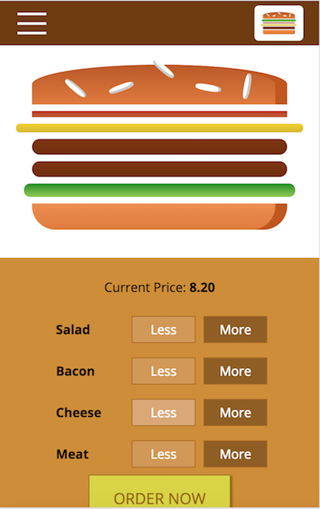

# react-16-the-complete-guide
Practicing with ReactJS

Source code made following the course <a href="https://www.udemy.com/react-the-complete-guide-incl-redux">React 16 - The Complete Guide (incl. React Router 4 & Redux)</a>, from Udemy.

This repo contains all the projects, assignments and challenges made throughout this course. The main project is the <a href="https://github.com/LuizParo/react-16-the-complete-guide/tree/master/00-burger-builder">Burger Builder</a> (find the details below), where all the concepts learned in this course were applied. The other projects are more focused in specific concepts, such as routing, redux, etc., which makes them a great source when trying to deep diving into these.

# Burger Builder App

Its main feature is to create a burger by choosing the ingredients you want to add or remove, seeing it being changed right away in the main screen burger. After customizing your burger, you can proceed to checkout page and create an order for it. It also has a page where you can see all the orders made for a specific user (authentication features, such as Sign Up and Sign In, are also included). Find below an image of the landing page (how it would be rendered in a mobile screen) of the app.

